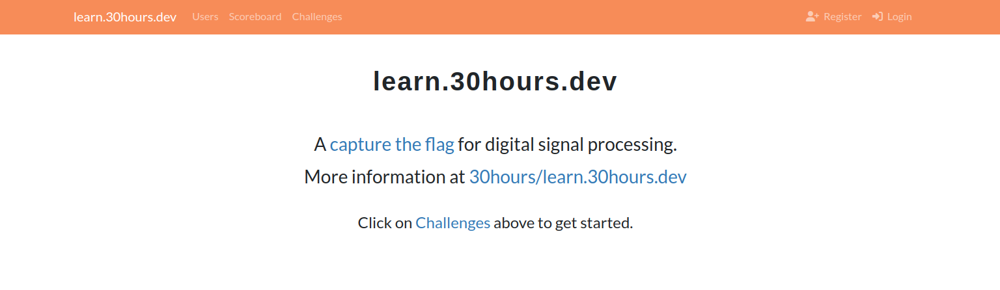

# learn.30hours.dev

A capture the flag for digital signal processing. Play at [https://learn.30hours.dev](https://learn.30hours.dev).

## Example

A beginner challenge is the "Noisy FM". An IQ recording of a noisy FM signal is provided. The user must demodulate the FM signal, locate the noise in frequency, filter off the noise, then listen to the audio to hear the flag. The flag e.g. `flag{this_is_the_flag}` is then typed in to complete the challenge.

## Applications

A list of topics that challenges may cover.

- Audio signal processing
- Radar and sonar
- Medical imaging
- Communications
- Model prediction

## Techniques

A list of techniques that challenges may cover.

- Fast fourier transform
- Filter design
- Time-frequency transforms
- Wavelets
- Ambiguity functions
- Algebraic signal processing

## Links

Join the [Discord](https://discord.gg/ewNQbeK5Zn) chat for discussion, support, and contributing.

## License

[MIT](https://choosealicense.com/licenses/mit/)

